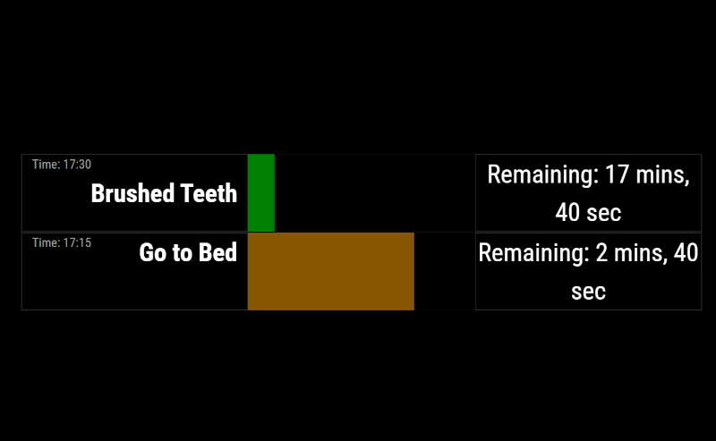

# MMM-MultiCountdownModule

Shows a set of configured countdown bars within specific time windows.  Inspired by a child needing some
hints on when it was time to go to school, brush teeth, go to bed, etc.  Configuration allows for 
the setting of windows of time where the countdown should be shown, with additional configuration
for displaying it before or after the time.

Intended to be shown as full screen for best effect, but doesn't have to be.

## Installation
```bash
cd ~/MagicMirror/modules
```

```bash
git clone https://github.com/ilenhart/MMM-MultiCountdownModule.git
```

## Example




## Configuration
Copy the example config to your MagicMirror config file:

```javascript

{
    module: "MMM-MultiCountdownModule",
    config : {
        showNowClock:true,
        forceShow: false,
        mmmPagesHiddenPageName: "multicountdown",
        mmmScenes2SceneName : "scene-timers",
        timers : [
            {
                displayName: "Brushed Teeth",
                deadlineTime: "07:50",
                active: true,
                showMinutesBefore: 5,
                hideMinutesAfter: 1,
                warningWindowMinutes: 5,
                dangerWindowMinutes: 1,
                showDaysOfWeek: [1,2,3,4,5]
            },
            {
                displayName: "Dressed for School ",
                deadlineTime: "07:45",
                active: true,
                showMinutesBefore: 5,
                hideMinutesAfter: 1,
                warningWindowMinutes: 10,
                dangerWindowMinutes: 2,
                showDaysOfWeek: [1,2,3,4,5]
            },
        ]
    }
},
```

The configuration takes a set of timers.  Each timer is responsible for a given window of time and shows as a progress bar counting up to the target time and then past the time.   If there is overlap in timers, then multiple timers weill be displayed.  

The timer is a progress bar that increases until the set time.  Before the time, the bar is green and changes from green, to yellow, to flashing orange as the time approaches.  After the deadline time, the bar turns red.  

### MMM-Pages

The module has limited integration with MMM-Pages (https://github.com/edward-shen/MMM-pages)  Meaning, if forceShow=true in the configuration, then this module will force MMM-pages to move to the hidden page specified (presumably containing this module) and pause MMM-pages from rotating.  
The assumption here is that in this case, this module is in an MMM-Pages hidden page which is not normally shown.
Effectively, if forceShow is true, and there is a timer for the current time, this module will stop everything else and just show the MMM-pages page that this module appears on.

### MMM-Scenes2

The module has limited integration with MMM-Scenes2 (https://github.com/MMRIZE/MMM-Scenes2).  If forceShow=true in the configuration, this module will play the scene specified by mmmScenes2SceneName and will pause the rotation of MMM-Scenes2.  In order to normally "hide" these timers, you will need to specify the proper previous/next of the scenes in the MMM-Scenes2 configuration.  Basically, you must configure MMM-Scenes2 to normally skip the scene containing this timer module, and then this module will force the "hidden" scene to play while pausing rotation.  When resuming (no timers active), the normal rotation should restart.


## General config options
| key  | Required | Description | Default |
| - | - | - | - |
| showNowClock  | no  | Show the current time | false  |
| forceShow  | no  | If using MMM-pages or MMM-Scenes2, whether to stop rotating pages/scenes and only show the proper page/scene while any timer is active | true  |
| mmmPagesHiddenPageName  | no  | MMM-pages, the name of the hidden page this might be on | multicountdown  |
| mmmScenes2SceneName  | no  | MMM-Scenes2, the name of the scene to play | scene-multicountdown  |

### Timer config options:

| key  | Required | Description | Default |
| - | - | - | - |
| displayName  | yes  | The name that will be displayed| (null)  |
| deadlineTime  | yes | The deadline/endtime (24h format : hh:mm)| |
| active  | no | Whether this particular timer is active or not (for easy deactivation without removing it) | false   |
| showMinutesBefore  | yes | Minutes before the deadline time to start showing the timer | 30   |
| hideMinutesAfter  | yes | Minutes after the deadline time to stop showing the timer | 5   |
| warningWindowMinutes  | yes | Minutes before the deadlineTime where bar changes from green to yellow | 10   |
| dangerWindowMinutes  | yes | Minutes before the deadlineTime where bar starts blinking and shows in orange | 5   |
| showDaysOfWeek  | yes | Which days to show this timer on. Array of weekdays (0=Sunday, 1= Monday, etc) | [0,1,2,3,4,5,6]  (all days) |


To be clear:
* If current time is within (deadlineTime - showMinutesBefore) and (deadlineTime + hideMinutesAfter) that timer will be displayed.  If the current time is not in that window, the timer is not shown at all.

Colors?  Moves from green to yellow to blinking orange to red over the lifetime of the timer.
* if current time is past the deadlineTime, the timer bar will be red
* If current time is past deadlineTime - dangerWindowMinutes, the timer bar will be orange and blinking.
* If current time is past deadlineTime - warningWindowMinutes, the timer bar will be yellow.
* If current time is anything else, the timer bar will be green.


## Contributing
Pull requests are welcome. For major changes, please open an issue first to discuss what you would like to change.

## License
[MIT](https://choosealicense.com/licenses/mit/)